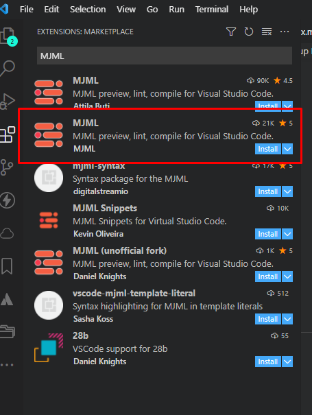
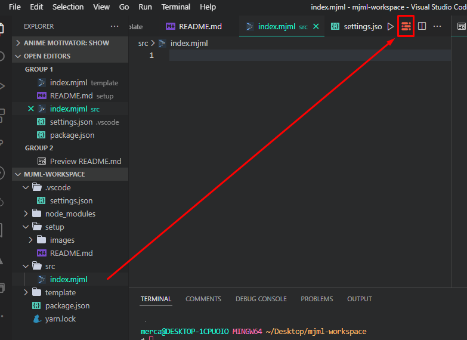

# Setup HTML Email Template Development Workflow with MJML

## Prerequisite

- install yarn
- install npm / node.js
- vscode editor

## Setup Workflow

1. Create your project folder.

2. Open your terminal.

3. Type `yarn init -y` to create a package.json file.

4. install these yarn packages:

```
yarn add -D mjml live-server concurrently
```

5. Install MJML extension



6. add this to the package.json's scripts:

```
"scripts" : {
    "build": "mjml src/index.mjml -o src/index.html",
    "start": "mjml -w src/index.mjml -o src/index.html",
    "server": "live-server --host=localhost --open=src",
    "dev": "concurrently \"yarn start\" \"yarn server\""
}
```

7. create `src` folder and an `index.mjml` file inside of it.

8. Create `.vscode` folder.

9. Inside .vscode folder, create a `settings.json` file.

10. paste this code in the settings.json file.

```
{
    "editor.formatOnSave": true,
    "editor.tabSize": 2,
    "[mjml]": {
        "editor.defaultFormatter": "mjmlio.vscode-mjml"
    }
}
```

11. your mjml workflow is now complete.

## Preview your MJML code

There are 2 ways to build and preview your mjml file:

- Through MJML extension
- Through Browser (preferred)

## Through MJML extension

1. Click the MJML preview.



## Through Browser (preferred)

1. open your terminal

2. type/run `yarn dev` to start developing your email template

3. after you finished the template, type/run `yarn build` to compile mjml to html
